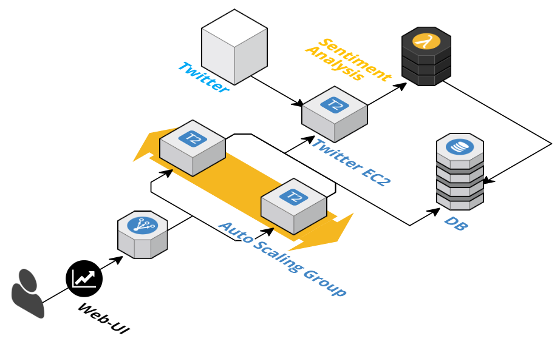

# Twitter Sentiment Analysis
Twitter Sentiment Analysis(TSA) is a cloud software platform for massive tweet analysis. TSA allows the user to run real-time sentiment analysis on one or multiple twitter streams. A web client then will visualize the analysis results in real time. TSA also gives the user the possibility to record the stream for a specified time.

In order to handle a any amount of tweets and clients concurrently TSA needs to be highly scalable and is therefore a perfect fit for "The Cloud".

## Background
Twitter is a social network for sharing messages (called tweets) all over the world. A tweet is a short text message of at most 140 characters. About 7500 tweets are created each second from users all over the world. See http://www.internetlivestats.com/twitter-statistics/ for more information.

## Architecture
A Web-UI allows the user to specify which Twitter streams he or she wants to have analyzed. A web server (EC2 t2.nano) subscribes to the desired streams and is simultaneously connected to the user via a web-socket. Whenever data is received by the web server, it sends a request to AWS Lambda which will analyze the sentiment of the tweets. The result of the analysis is then send to the user and will be visualized in the Web-UI. 

If the user wants to have a look at the sentiment data at later point in time, the result of the analysis needs to be persisted. This is done using an AWS DynamoDB instance that can be directly accessed by AWS Lambda and AWS EC2. By accessing the DynamoDB directly from Lambda the workload of the EC2 should be reduced.

## Technologies

The following technologies will be used with the different cloud services:

- *Web Server*: The web server running on the AWS EC2 instance will be build using node.js.
- *Sentiment Analysis*: The sentiment analysis running on AWS lambda will be implemented with node.js.
- *Persistence*: DynamoDB, the NoSQL DB by AWS will be used to have greater flexibility compared to a SQL database.
- *Web-UI*: The frontend will be implemented using Elm, a functional programming language that compiles to JavaScript.

## Visualization

The sentiment data generated by the backend will be visualized in a graph chart in real-time. Each Twitter Stream that the user subscribes to will be represented by a graph. The time is displayed on the x-axis and the sentiment on the y-axis.

## Next Steps
After the core functionality described above is fully implemented, the following additional tasks could be worked on.
### Lambda - EC2 Comparison 

The sentiment analysis could be ported to an AWS EC2 instance. This would allow a comparison of scalability and cost of Lambda and EC2 when doing CPU heavy tasks.

### Add Additional Cloud Services        

The application could be extended with additional cloud services. One possibility would be to use AWS SES (Simple Email Service) to allow users to trigger the sentiment analysis of Twitter streams via email and/or receive the result via email.

